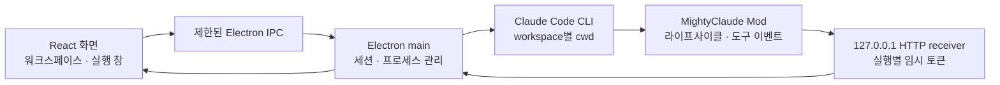

# Claude Mods 분석과 ADE 연결 구조

분석일: 2026-09-16

## 분석 대상

이 프로젝트의 기반은 Anthropic이 공개한 **Claude Mods / Function Hooks**로 해석했다. 사용자에게 별도 저장소가 지정되지는 않았다. 동명의 `0xDarkMatter/claude-mods`는 스킬 모음이므로 이번 실행 엔진 분석의 대상에 포함하지 않는다.

공식 제안의 9월 9일 업데이트는 Mods를 TypeScript function hooks를 사용하는 Claude Code plugin으로 설명하며, `CLAUDE_CODE_ENABLE_FUNCTION_HOOKS=1`로 실험할 수 있다고 안내한다. 안정화된 데스크톱 프레임워크로 간주해서는 안 된다. [공식 제안과 업데이트](https://github.com/anthropics/claude-code/issues/91870)

## 확인한 구조

공식 저장소는 `sec-default`, `diff`, `telemetry` 세 내장 Mod의 소스를 제공한다. Mod는 기존 plugin 디렉터리에 hooks module을 더하는 형태다. `register(on, options)`가 이벤트별 함수를 등록하고 `($, event, next)`가 다음 hook과 엔진 실행을 감싼다. [공식 Mods README](https://github.com/anthropics/claude-code/tree/main/mods)

```text
my-mod/
├── .claude-plugin/plugin.json
└── hooks/
    ├── hooks.json
    └── register.ts
```

`hooks/hooks.json`의 module 경로는 다음과 같다. [공식 diff manifest](https://github.com/anthropics/claude-code/blob/main/mods/diff/hooks/hooks.json)

```json
{ "modules": ["./register.ts"] }
```

공개 타입 파일은 **Claude Code 2.1.271**에서 생성되었다. 아래는 그 선언에서 확인한 계약이며, 설치된 모든 CLI 버전의 동작을 보장하지 않는다. [공식 타입 선언](https://github.com/anthropics/claude-code/blob/main/mods/types/claude-code.d.ts)

| 영역 | 확인한 계약 |
| --- | --- |
| 실행 환경 | DOM과 Node API가 없는 별도 환경. 파일·네트워크·프로세스 작업은 `$`를 통한다. |
| 외부 전송 | `$.http.fetch(url, { method, headers, body })`. 호스트가 접근할 수 있는 HTTP/HTTPS 주소이며 관리자 정책을 따른다. 응답은 `{ status, ok, headers, text }`. |
| 환경변수 | `$.env.get('변수명')`. 이름은 소스에 문자열 리터럴로 명시해야 한다. |
| 식별 | `$.session.id()`로 CLI 세션 ID를 얻는다. |
| 시작 | `session.start`: `cwd`, `surface`, `isInteractive`. |
| 턴 | `turn.start`: `text`, `turnId`. `turn.complete`: `answer`, `durationMs`, `isAborted`, `turnId`, 선택적 `agentId`·`usage`, 종료 `reason`. |
| 도구 | `tool.call`: `tool`, `tool_use_id`, 인자. `next(event)`가 권한 확인과 실제 실행을 이어간다. |
| 사용자 입력 | `$.prompt.submit({ text })`, `$.turn.abort({ turnId })`가 있다. 외부 앱으로 제공되는 전용 RPC는 별도로 구현해야 한다. |
| UI | `ui.render`, `ui.press` 등은 Claude가 제공하는 surface에 그리는 계약이다. Electron의 React DOM에 직접 마운트하는 API는 아니다. |

`HttpInit`에는 timeout이나 AbortSignal 옵션이 없다. 연결 오류로 실행 흐름을 붙잡지 않도록 전송 큐와 실패 처리를 앱 계약에 둔다. `on`, `$` 접근은 정적 검사되므로 `$` 전체를 동적으로 전달하거나 메서드를 임의 이름으로 치환하는 구현은 피한다.

## 로컬 검증 결과

- CLI 경로: `/Users/young/.local/bin/claude`
- `claude --version`: **2.1.263 (Claude Code)**
- 임시 디렉터리와 격리된 `CLAUDE_CONFIG_DIR`에서, function hooks flag를 켜고 `claude plugin validate <임시 플러그인>` 실행.
- `modules: ["./register.ts"]`, `on('session.start', ...)`, `$.env.get`, `$.http.fetch`를 정확히 인식하고 **exit 0**. author 메타데이터 누락 경고만 있었다.
- `--init-only`는 exit 0이었지만 임시 `session.start` 관측 파일이 생성되지 않았다. 이 모드는 모델 대화를 시작하지 않으므로, 해당 결과로 Mod의 세션 실행 지원 여부를 판정하지 않는다.
- 모델 요청, 사용자 인증정보 열람, CLI 업데이트, 전역 plugin 설치는 수행하지 않았다. 이벤트 실시간 전달 검증은 별도 실행 테스트가 필요하다.

일반 CLI는 `--plugin-dir`로 세션에만 plugin을 로드하고, `--session-id`·`--resume`로 대화를 식별할 수 있다. 비대화형 출력을 선택하면 `--print --output-format stream-json`을 사용할 수 있다. [공식 CLI reference](https://code.claude.com/docs/en/cli-reference)

### 후속 검증: CLI 업데이트

2026-09-16 사용자의 요청으로 공식 `claude update`를 실행하여 **2.1.263 → 2.1.273**으로 업데이트했다. `claude --version`으로 새 버전을 확인했다. 별도 임시 `CLAUDE_CONFIG_DIR`와 function hooks flag를 사용한 `claude plugin validate ./mods/mighty-bridge`도 통과했으며, 네 개 hook과 `$.env.get`·`$.http.fetch`·`$.session.id`가 인식됐다. 일반 사용자 환경에서 `claude auth status --json`의 로그인 상태도 확인했다. 계정 식별자나 토큰은 출력하지 않았으며 모델 대화를 보내거나 로그인 설정을 변경한 검증은 아니다.

## MightyClaude 설계 제안

아래는 위 계약에 근거한 **프로젝트 자체 설계**이며, Anthropic이 제공하는 ADE transport 사양이 아니다.



1. **실행 창마다 독립된 실행 ID와 CLI 세션 ID**를 관리한다. 워크스페이스 경로를 `cwd`로 설정한다.
2. Main이 receiver를 먼저 열고, 임시 token과 endpoint를 자식 CLI의 환경변수로 전달한다. 수신은 `127.0.0.1`에만 바인딩하고 실행 ID·토큰·메시지 크기를 검사한다.
3. Mod는 선택한 이벤트를 프로젝트의 versioned envelope로 변환한다. 초기 envelope는 `protocolVersion`, `runId`, `sequence`, `type`, `payload`면 충분하다. UI에 CLI 원본 이벤트를 직접 결합하지 않는다.
4. 이벤트 전송 실패는 원래 `next(event)` 실행과 결과를 보존하면서 연결 상태로 보고한다. wildcard 전체 수집보다 필요한 네 이벤트부터 연결한다.
5. 입력·승인·중단은 명시적인 세션 제어 계약으로 관리한다. Mod의 관측 hook이 도구 허가를 자동으로 반환하지 않도록 한다.
6. CLI 발견, 버전, Mod 검증, 실제 handshake를 각각 구분한다. **CLI 설치됨**을 **Mod 연결됨**으로 표시하지 않는다. Early-access 변경은 이 경계에서 처리한다.
7. macOS/Windows 경로와 실행 파일을 OS별 resolver에서 처리한다. 셸 문자열 결합 대신 executable과 인자 배열로 실행한다.

## 소스 재사용 범위

공식 저장소의 `LICENSE.md`는 Anthropic의 권리 보유와 Commercial Terms 적용을 명시한다. 따라서 이 골격은 사용자가 설치한 CLI를 호출하고, 공식 내장 Mod를 통째로 복사하지 않는 자체 bridge 구현을 전제로 한다. [공식 저장소 라이선스](https://github.com/anthropics/claude-code/blob/main/LICENSE.md)
