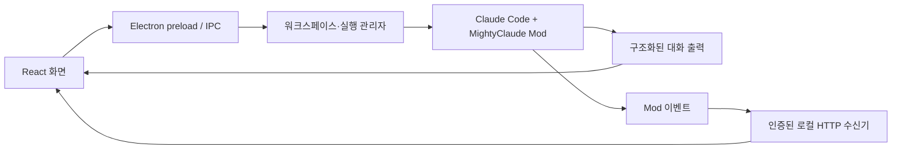

# MightyClaude

Claude Code·Codex·Gemini CLI를 함께 사용하는 Windows·macOS용 ADE입니다. Claude Code는 Claude Mods로 연결합니다. 왼쪽에서 로컬·원격 작업 폴더를 선택하고, 오른쪽에서 여러 AI 실행 창과 명령 실행 창을 관리합니다. [Orca](https://www.onorca.dev/)의 워크스페이스·분할 창 구조를 참고했습니다.

## 시작

Node.js **22.12 이상**과 npm이 필요합니다.

```sh
npm install
npm run dev
```

앱에서 **워크스페이스 열기**로 폴더를 선택한 뒤 Claude 또는 명령 실행 창을 추가하세요. 실행 창은 같은 워크스페이스 폴더를 사용합니다. Git worktree별 파일 격리는 아직 구현하지 않았습니다.

브라우저에서 화면만 확인하려면:

```sh
npm run dev:web
```

`http://127.0.0.1:5173`에서 워크스페이스·실행 창·배치와 테마를 시험할 수 있습니다. 브라우저 미리보기는 샘플 작업 폴더를 사용하며 로컬 명령이나 Claude를 실행하지 않습니다.

## 포함된 기능

- 워크스페이스 추가, 검색, 전환, 목록에서 제거
- 워크스페이스별 여러 실행 창과 독립적인 입력·출력·상태
- 격자, 나란히, 집중 보기와 사이드바 너비 조절
- Claude 모델·사고 강도 선택, 실행 창별 권한·턴 수·비용 한도, 세션 이어가기
- 워크스페이스·실행 기록·테마·배치의 로컬 저장
- Claude CLI 발견, 버전 확인, Mods 호환 기준 표시
- 실행 창별 Claude·Codex·Gemini CLI 전환과 프로바이더별 지원 설정
- Tailscale을 통한 다른 MightyClaude의 워크스페이스 연결·실행·중지
- macOS·Windows용 Electron 실행 및 패키징 구성

**명령 실행 창은 명령 단위 프로세스 실행기입니다.** 대화형 셸/PTY가 아니므로 `vim`, SSH 로그인, 전체 화면 TUI용 터미널로 사용하지 않습니다. 각 명령은 워크스페이스 폴더에서 새로 시작하며 앞선 `cd`나 환경변수 변경을 유지하지 않습니다.

## 실행 창 설정

실행기 선택에서 **Claude Code**, **Codex CLI**, **Gemini CLI**를 선택합니다. 각 CLI는 작업을 실행하는 컴퓨터에 설치하고 로그인해야 합니다. 실행기를 바꾸면 모델·설정·이전 실행기의 대화 이어가기 ID가 초기화됩니다. 지원하지 않는 설정은 비활성화됩니다.

| 실행기 | 모델과 사고 강도 | 실행 권한과 제한 |
| --- | --- | --- |
| Claude Code | CLI 모델 목록과 모델별 지원 강도 | 기본·계획·편집 허용, 턴 수·비용 한도 |
| Codex CLI | CLI `model/list` 목록. 지원 강도를 확인한 모델에서 High 등을 선택 | 읽기 전용·프로젝트 폴더 수정. 턴 수·비용 한도는 비활성화 |
| Gemini CLI | CLI 기본 설정·Auto·공식 모델 이름 예시. 사용 가능 여부는 계정에 따라 다름 | 기본·계획·편집 허용. 사고 강도·턴 수·비용 한도는 비활성화 |

Codex의 기본 모델처럼 지원 강도를 확인하지 못한 경우에는 Auto만 사용합니다. Codex와 Gemini는 각 CLI의 구조화된 출력을 사용하며 Claude Mods 호환 검사와 독립적으로 실행합니다.

Claude 실행 창의 입력란 아래에서 **모델**과 **사고 강도**를 선택합니다. 모델 목록은 설치된 Claude CLI가 알려주는 이름과 지원 강도를 우선 사용합니다. 조회하지 못하면 공식 모델 별칭을 표시하며, 계정에서 사용할 수 있는지는 Claude의 제공자·조직 설정에 따라 달라집니다. **Claude 설정 따름**은 기존 모델 설정이나 재개한 세션의 모델을 유지합니다.

목록 조회에는 공식 Agent SDK의 `supportedModels()`를 사용합니다. 설치된 CLI를 안전 모드로 초기화하고 메타데이터만 읽으며, 모델에 메시지를 보내지 않습니다. 실제 작업 실행은 기존 Claude Mods 연결을 사용합니다. 목록을 다시 불러오려면 앱 설정에서 **실행 환경 다시 확인**을 누르세요.

사고 강도는 모델이 지원하는 `Low`, `Medium`, `High`, `XHigh`, `Max` 중 선택합니다. `기본값`은 Claude 설정을 따릅니다. Haiku 등 미지원 모델로 바꾸면 강도는 기본값으로 전환합니다.

Claude 실행 창의 **실행 설정**에서 다음 항목을 저장할 수 있습니다.

| 설정 | 적용 방식 |
| --- | --- |
| 작업 권한 | 표준(`manual`), 계획(`plan`), 편집 허용(`acceptEdits`) 중 선택. 편집 허용은 파일 편집을 자동 승인하지만 다른 도구의 승인 규칙은 유지합니다. |
| 최대 턴 수 | 한 번의 요청에 허용할 에이전트 턴 수. 빈칸은 Claude 기본 동작을 따릅니다. |
| 비용 한도 (USD) | 한 번의 요청에 `--max-budget-usd`로 전달하는 한도. 실행 창의 누적 예산이 아닙니다. |

설정은 실행 창마다 독립적으로 저장되고 다음 요청부터 적용됩니다. 실행 중에는 변경할 수 없습니다. 현재 앱은 새 승인 질문을 표시하지 않으므로 승인이 필요한 도구 요청은 거부됩니다. 전역 Claude 설정 파일은 변경하지 않습니다.

모델·강도와 실행 인자의 기준은 [Claude 모델 설정](https://code.claude.com/docs/en/model-config)과 [CLI 참조](https://code.claude.com/docs/en/cli-reference)입니다.

## 다른 컴퓨터에 연결

양쪽 컴퓨터의 Tailscale을 연결한 다음, 호스트의 **원격 연결**에서 공유할 워크스페이스를 선택합니다. 다른 앱에 호스트 주소와 연결 키를 입력하면 해당 컴퓨터에서 실행하고 이 앱에서 결과를 볼 수 있습니다. 공유는 사용자가 켤 때 시작합니다.

연결 순서, 실행 중지, 키 저장 방식은 [원격 워크스페이스 안내](remote-workspaces.md)를 참고하세요.

## Claude Mods 연결

여기서 Mods는 Anthropic의 **Function Hooks**입니다. [분석 문서](claude-mods-analysis.md)에 공식 자료, 로컬 검증 결과와 설계 근거를 정리했습니다.



- 사용자가 설치하고 로그인한 Claude Code CLI를 사용합니다.
- 앱이 실행한 자식 CLI에만 function hooks 설정과 `--plugin-dir`를 전달합니다. 전역 플러그인 설치가 필요하지 않습니다.
- Mod는 세션·턴·도구 이벤트를 앱에 전달하고 원래 hook 실행과 권한 확인을 이어갑니다.
- 앱은 `--print --output-format stream-json` 출력으로 응답을 표시합니다. `--permission-prompts none`으로 승인 대기를 방지하며, 기존 허용 규칙에 없는 새 승인이 필요한 도구 요청은 거부됩니다. 도구 승인을 앱에서 받는 기능은 후속 단계입니다.
- 연결 이벤트는 `127.0.0.1`과 실행별 임시 인증 토큰을 사용합니다.

**호환 기준:** 이 앱의 Mod는 공개된 **Claude Code 2.1.271 타입**을 기준으로 작성했습니다. 이는 Anthropic이 선언한 공식 최소 버전이 아니라 프로젝트의 호환 기준입니다. Mods는 초기 공개 API이므로 CLI 버전만으로 실제 연결 성공을 보장할 수 없습니다.

초기 개발 환경의 CLI는 2.1.263입니다. 이 버전에서 최소 Mod의 정적 검증은 통과했으나 최신 계약으로 실제 모델 요청과 Mod 이벤트를 주고받는 검증은 수행하지 않았습니다. 앱은 기준보다 오래된 CLI에서 Claude 실행을 안내 메시지와 함께 차단합니다.

## 프로젝트 구조

```text
electron/              데스크톱 창, IPC, 저장소, 실행기, Mods 수신기
mods/mighty-bridge/    Claude 내부에서 로드하는 자체 Mod
shared/types.ts        화면과 데스크톱 간 계약
src/components/       워크스페이스·실행 창·대화상자
src/lib/              화면 상태와 브라우저 미리보기 어댑터
docs/                 Claude Mods 분석
tests/                실행·저장·연결 계약 검증
```

프로세스/파일 접근은 Electron main에 두고, 화면은 제한된 preload API를 사용합니다. Claude의 Mods API가 바뀌면 `mods/mighty-bridge`와 수신 계층에서 대응하도록 나눴습니다.

## 검증과 빌드

```sh
npm run check          # TypeScript 검사, 단위 테스트, 데스크톱 코드 빌드
npm run test:desktop   # 격리된 앱 프로필로 창/실제 명령 실행/복원 확인
npm run test:ui        # 브라우저 UI 테스트 (최초 npx playwright install chromium)
npm run build:web      # 브라우저 미리보기 빌드
npm run package:dir    # 설치 프로그램 없이 앱 디렉터리 생성
npm run package:mac    # macOS: DMG / ZIP
npm run package:win    # Windows: NSIS 설치 프로그램
```

패키징 결과는 `release/`에 생성됩니다. 각 운영체제에서 해당 패키징 명령을 실행하세요. 배포용 인증서·서명·공증과 자동 업데이트는 후속 단계입니다. `.github/workflows/check.yml`에 Windows·macOS 검사와 앱 디렉터리 빌드를 구성했습니다.

실제로 수행한 검사와 미검증 범위는 [검증 기록](verification.md)에 정리했습니다.

현재 단계는 워크스페이스와 실행 창의 기반입니다. 완전한 대화형 터미널, Git worktree 생성, 도구 승인 UI, 파일 편집기, 변경사항 검토는 후속 확장 영역입니다.
